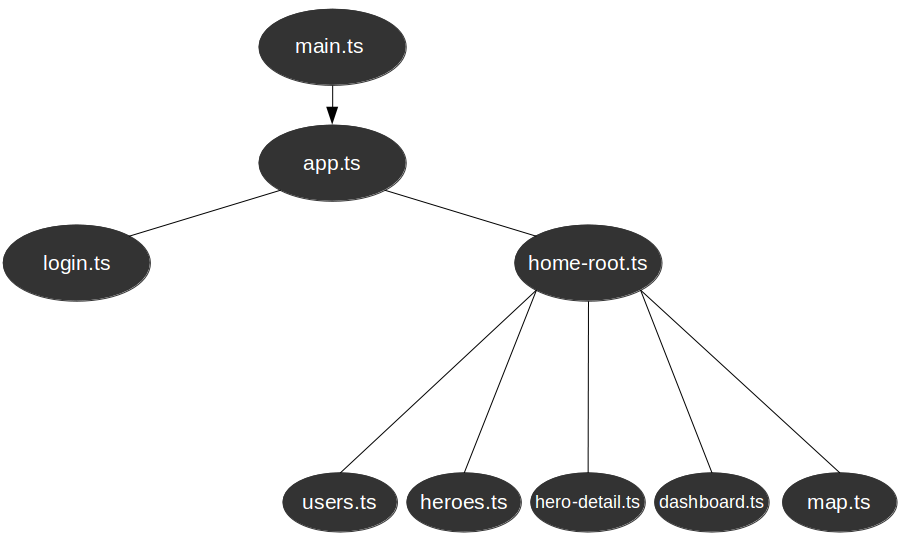

#angular2-login-seed

[](http://opensource.org/licenses/MIT)
[](https://david-dm.org/domfarolino/angular2-login-seed)
[](https://david-dm.org/domfarolino/angular2-login-seed#info=devDependencies)
[](https://camo.githubusercontent.com/495f5e3a82030e6bd99569430828c46591cfe8bf/68747470733a2f2f6d6765636865762e6769746875622e696f2f616e67756c6172322d7374796c652d67756964652f696d616765732f62616467652e737667)

A seed application for developers to get started building applications with Angular2. The application's backend is in Node.js featuring user login via PassportJS and OAuth.

[](https://github.com/domfarolino/angular2-login-seed)

## Table of Contents

  1. [Demo](#demo)
  1. [Technologies](#technologies)
  1. [Adding OAuth Providers](#adding-oauth-providers)
  1. [TL;DR Get started now](#tldr-get-started-now)
  1. [Angular Component Tree](#angular-component-tree)
  1. [Directory Structure](#directory-structure)
  1. [Contributing](#contributing)
  1. [Todo](#todo)

## Demo
Check this site out live [here](https://angular2-login-seed.herokuapp.com)

## Technologies
Some of the open source technologies used in this application are listed below
  1. [Angular 2](https://angular.io/)
  1. [Angular Material2](https://github.com/angular/material2)
  1. [Node.js](https://nodejs.org/)
  1. [Express](http://expressjs.com/)
  1. [Passport](http://passportjs.org/)
  1. [Sequelize](http://docs.sequelizejs.com/en/latest/)

## TL;DR Get started now

```sh
# Fork or clone this repo
git clone git@github.com:domfarolino/angular2-login-seed.git
npm install
```
Next, either input your Google and Twitter application's OAuth credentials in the `config/default.json` file, or follow [this](https://domfarolino.github.io/Registering-An-OAuth-App/) guide to set up an OAuth application with Google and Twitter.

You'll need either a local or production database which the application will use to store `users`. The structure of this database is defined in the `dbStructure.sql` file found in the root folder. Execute its sql contents on a database to create a users table to house your users.

> To learn about how the npm package `config` works click [here](https://www.npmjs.com/package/config)

Next fill out either the `config/default.json`, `config/production.json` or both with database credentials so that `Sequelize` knows how to connect to your database when you're in development or production mode. You'll also want to fill out the `oauthCallbacks` object with callback URLs for your app.
The finished product should look something like this:

```javascript
{  
  "database-configuration": {
    "host": "localhost",
    "user": "user",
    "pass": "pass",
    "name": "dbName"
  },
  
  "oauthCredentials": {
    "twitter": {
        "id": "<>",
        "secret": "<>"
    },
    "google": {
        "id": "<>",
        "secret": "<>"
    }
  },
  
  "oauthCallbacks": {
    "googleCallbackUrl"  : "http://localhost:5000/callback/google",
    "twitterCallbackUrl" : "http://localhost:5000/callback/twitter",
    "facebookCallbackUrl": "http://localhost:5000/callback/facebook"
  }
}
```

Your `config/production.json` should only contain data that will overwrite any of the default data when you're in production mode.

Then type one of the following commands into the terminal:
```sh
npm run # run in production mode, uses default.json values unless they're overridden in production.json
```
Or
```sh
npm run dev # run in development mode, uses default.json values only
```

That should be it! Just browse to `http://localhost:5000` to see the app.

### Further development
For further development, open a new terminal window and type `npm run front`. This will transpile and "watch" all of your typescript files for any changes.


## Adding OAuth Providers
I've tried to make it as easy as possible to add more OAuth providers to this app to keep it flexible.
If you think it can be done better please submit a PR to improve the maintainability of the app.
To add support for another OAuth provider 4 things need to be done:

##### 1. Add authorization and callback routes for the provider (edit `/routes/index.js`)
```
/**
 * Authorization route for <provider> provider
 */
router.get('/authorize/provider',
  passport.authenticate('provider'));

/**
 * Define our provider callback endpoint and success/failure methods 
 */
router.get('/callback/provider', 
	passport.authenticate('provider', { 
		successRedirect: '/',
		failureRedirect: '/provider'
}));
```
##### 2. Add your OAuth credentials to the `/config/default.json` file. You'll use these in `/config/passport.js` which you'll edit next

##### 3. Setup/use PassportJS strategy in `/config/passport.js`
```
passport.use(new ProviderStrategy({....
```

##### 4. Update the attribute utility functions at the end of `/config/passport.js` to support your provider

This entails basically examining the JSON payload you get back from your provider and seeing
under what keys, the information you need to insert into the database exists under. If any database/model
changes need made modify the database appropriately and update the User model `/models.js`


## Angular Component Tree


## Directory Structure
The goal is to keep as flat of a directory structure as possible for all of the Angular components. Reasons for this, as well as grouping files by bounded context can be found [here](https://github.com/mgechev/angular2-style-guide#directory-structure).

```
.
├─.gitignore
├─app-component-tree.png
├─app.js
├─bin
│   ├─www
├─client
│   ├─app
│   │   ├─app.component.css
│   │   ├─app.component.html
│   │   ├─app.component.js
│   │   ├─app.component.js.map
│   │   ├─app.component.ts
│   ├─assets
│   │   ├─favicon.ico
│   │   ├─img
│   │   │   ├─background.jpg
│   │   │   ├─bg.png
│   │   │   ├─menu_bg.jpg
│   │   │   ├─menu_bg_small.jpg
│   │   │   ├─space_bg.jpg
│   ├─dashboard
│   │   ├─dashboard.component.html
│   │   ├─dashboard.component.js
│   │   ├─dashboard.component.js.map
│   │   ├─dashboard.component.ts
│   ├─hero-detail
│   │   ├─hero-detail.component.css
│   │   ├─hero-detail.component.html
│   │   ├─hero-detail.component.js
│   │   ├─hero-detail.component.js.map
│   │   ├─hero-detail.component.ts
│   ├─heroes
│   │   ├─heroes.component.css
│   │   ├─heroes.component.html
│   │   ├─heroes.component.js
│   │   ├─heroes.component.js.map
│   │   ├─heroes.component.ts
│   ├─home-root
│   │   ├─home-root.component.css
│   │   ├─home-root.component.html
│   │   ├─home-root.component.js
│   │   ├─home-root.component.js.map
│   │   ├─home-root.component.ts
│   ├─login
│   │   ├─login.component.css
│   │   ├─login.component.html
│   │   ├─login.component.js
│   │   ├─login.component.js.map
│   │   ├─login.component.ts
│   ├─main.js
│   ├─main.js.map
│   ├─main.ts
│   ├─shared
│   │   ├─components
│   │   │   ├─quick-card
│   │   │   │   ├─quick-card.component.css
│   │   │   │   ├─quick-card.component.html
│   │   │   │   ├─quick-card.component.js
│   │   │   │   ├─quick-card.component.js.map
│   │   │   │   ├─quick-card.component.ts
│   │   ├─services
│   │   │   ├─hero
│   │   │   │   ├─hero.js
│   │   │   │   ├─hero.js.map
│   │   │   │   ├─hero.service.js
│   │   │   │   ├─hero.service.js.map
│   │   │   │   ├─hero.service.ts
│   │   │   │   ├─hero.ts
│   │   │   ├─user
│   │   │   │   ├─user.js
│   │   │   │   ├─user.js.map
│   │   │   │   ├─user.service.js
│   │   │   │   ├─user.service.js.map
│   │   │   │   ├─user.service.ts
│   │   │   │   ├─user.ts
│   ├─users
│   │   ├─user-badge.component.css
│   │   ├─user-badge.component.html
│   │   ├─user-badge.component.js
│   │   ├─user-badge.component.js.map
│   │   ├─user-badge.component.ts
│   │   ├─users.component.css
│   │   ├─users.component.html
│   │   ├─users.component.js
│   │   ├─users.component.js.map
│   │   ├─users.component.ts
├─config
│   ├─default.json
│   ├─passport.js
│   ├─production.json
├─controllers
│   ├─getAllUsersPublic.js
│   ├─getUserPublic.js
│   ├─index.js
├─dbStructure.sql
├─directoryStructure.txt
├─index.html
├─LICENSE
├─logo.png
├─logo_post_polymer.png
├─models
│   ├─index.js
│   ├─user.js
├─package.json
├─Procfile
├─README.md
├─routes
│   ├─api
│   │   ├─index.js
│   │   ├─users.js
│   ├─authenticationHelpers.js
│   ├─index.js
├─tsconfig.json
├─views
│   ├─error.ejs


```


## Contributing
Please feel free to contribute to this project to help build more defined practices we can use in larger Angular 2 web
applications. PRs are welcome!

## Todo
 1. Angular 2 route security
 1. PassportJS Local Login
 1. Progressive Web App - Service Worker Caching
 1. Progressive Web App - [Push Notification](https://developers.google.com/web/updates/2016/03/web-push-encryption?hl=en) support with [encrypted payload](https://github.com/GoogleChrome/web-push-encryption)
 1. Eventually implement [angular/mobile-toolkit](https://github.com/angular/mobile-toolkit) when more progress is made
 1. User 'profile' page
 1. Update `@angular/router-deprecated` => `@angular/router` when rc router is near completion
 1. RxJS websocket integration for realtime user status
 1. Unit testing
